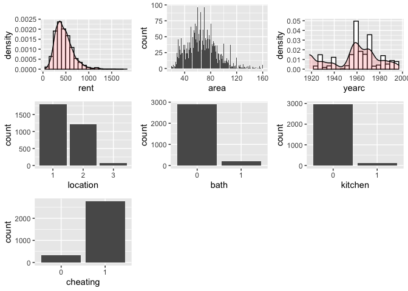
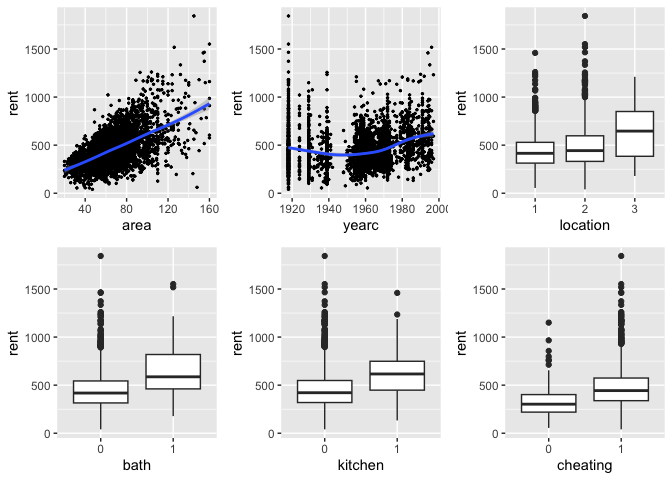
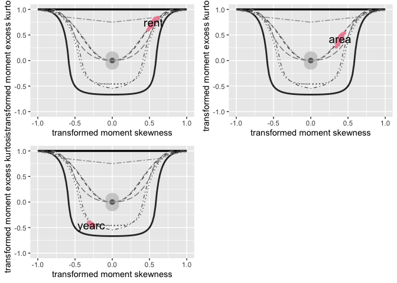

# gamlss.prepdata: Preparing data for Distributional Regression

## Overview

The purpose of this package is to provide functions to facilitate the
creation of `data.frame`’s suitable for statistical modelling analysis
and especially distributional regression models using
[`gamlss`](https://cran.r-project.org/package=gamlss) and.
[`gamlss2`](https://github.com/gamlss-dev/gamlss2) packages.

There is a lot of information which can be gain using a preliminary data
analysis. One could seeking information about the *variables* in the
data set themselves, on *outliers*, on *associations* between variables,
what *type* of relationships exist between the response and the
explanatory variables (linear or not linear) and possible *interactions*
between the explanatory variables. In addition, one, at this stage,
could decide appropriate *partitions* of to maximise statistical
inference. While answers to those questions are not necessarily final,
at this pre-modelling stage, they could help at the next stage of the
fitting process. All functions in the package can be used before the
functions or are used for modelling.

## Installation

You need the package `devtools`;

``` r
library(devtools)
install_github("mstasinopoulos/gamlss.prepdata") 
```

## Licence

The package is available under the [General Public License version
3](https://www.gnu.org/licenses/gpl-3.0.html)

## Functions

The functions for manipulation of variables are shown below

| Functions.               | usage                                  |
|:-------------------------|:---------------------------------------|
| `data_dim()`             | dimensions & % of omitted observations |
| `data_names()`           | names of the data                      |
| `data_distrinct()`       | distinct values in variables.          |
| `data_which(()`          | NA’s in variables                      |
| `data_str()`.            | the class of variables e.t.c           |
| `data_omit()`            | Omit all the NA’s                      |
| `data_char2fac()`        | from characters to factors             |
| `data_few2fac()`         | from few distinct obs. to factors      |
| `data_int2num()`         | from integers to numeric               |
| `data _rm()`             | remove variables                       |
| `data _rm1val()`         | remove factors with one level          |
| `data _rename()`         | rename variables                       |
| `data _renamove()`       | remove variables                       |
| `data _select()`         | select variables                       |
| `data _exclude_class()`  | exclude a specified class              |
| `data _only_continous()` | includes only continuous               |
| `data_rmNAvars()`        | remove variables with NA values        |
| `data_fac2num()`         | make factor numeric                    |

The function for graphics are show below

| Functions.          | usage                                                |
|:--------------------|:-----------------------------------------------------|
| `data_plot()`       | univariate plots of all variables                    |
| `data_xyplot()`     | pairwise plots of the response against all others    |
| `data_bucket()`     | bucket plots of all variables                        |
| `data_cor(()`       | pairwise correlations                                |
| `data_pcor(()`      | pairwise partial correlations                        |
| `data_void()`       | pairwise % of empty spaces                           |
| `data_inter()`      | pairwise interactions                                |
| `data_respose()`    | response variable plots                              |
| `data_zscores()`    | univariate plots using z-scores                      |
| `data_outliers()`   | univariate detection of outliers                     |
| `data_leverage()`   | detection of outliers in the x’s space               |
| `data_scale()`      | univariate scaling the x’s                           |
| `data_trans_plot()` | checking for univivariate transformations in the x’s |

## Graphics

Here some of the graphical functions examples

``` r
rm(list=ls())
library(gamlss)
library(gamlss2)
library(ggplot2)
library(gamlss.ggplots)
library(gamlss.prepdata)
library("dplyr") 
packageVersion("gamlss.prepdata")
```

    [1] '0.1.5'

``` r
da <- data_rm(rent99, c(2,9)) 
dim(rent99)
```

    [1] 3082    9

``` r
dim(da)
```

    [1] 3082    7

## `data_plot()`

The function `data_plot` plots all the variable of the data
individually. It plots;

- the continuous variable as *histograms* with a density plots
  superimposed, (see the plots for `rent` and `yearc` below).
  Alternatively a *dot plots* can be requested, (see the example in
  **?@sec-data_response**).

- the integers as *needle* plots, (see the plot for `area` below).

- the categorical variables, as *bar* plots, (see the plots for
  `location`, `bath` `kitchen` and `cheating` below).

The message `100 % of data are saved` below is the result of the
function `data_cut()` which is use before any `ggplot2` plot.

``` r
da |> data_plot()
```

     100 % of data are saved, 
    that is, 3082 observations. 



The function could saves the `ggplot2` figures.

## `data_xyplot()`

The functions `data_xyplot()` plots the response variable against each
of the independent explanatory variables. It plots the continuous
against continuous as *scatter* plots and continuous variables against
categorical as *box* plot.

> [!WARNING]
>
> At the moment there is no provision for categorical response
> variables.

``` r
da |> data_xyplot(response=rent )
```

     100 % of data are saved, 
    that is, 3082 observations. 

    `geom_smooth()` using method = 'gam' and formula = 'y ~ s(x, bs = "cs")'
    `geom_smooth()` using method = 'gam' and formula = 'y ~ s(x, bs = "cs")'



The output of the function saves the `ggplot2` figures.

## `data_bucket()`

The function `data_bucket` can be used to identifies hight skewness and
kurtosis on continuous variables in the data. Note that if the
continuous variable is normaly distribueterd looking should be in the
center of the figure.

``` r
data_bucket(da, response=rent )
```

     100 % of data are saved, 
    that is, 3082 observations. 
        rent     area    yearc location     bath  kitchen cheating 
        2723      132       68        3        2        2        2 


